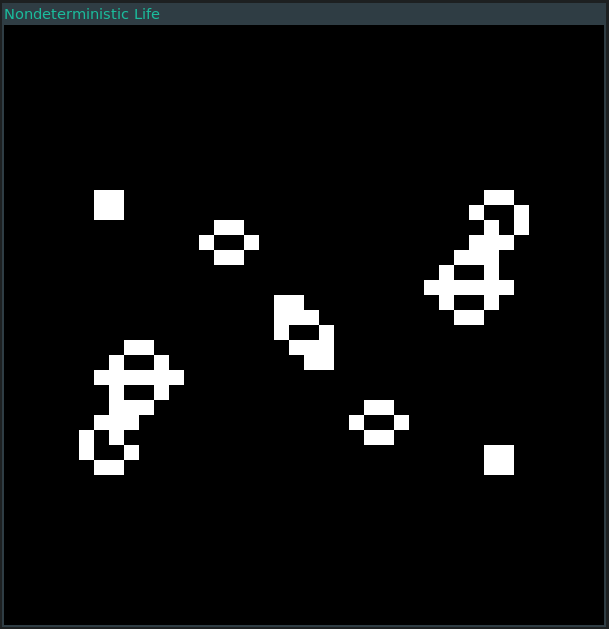

# Game of Life

A simple implementation of ["Conway's Game of Life"] in Rust using the
[Bevy game engine]. This application on has minimal support for seeing how an
initial state evolves.

A set of initial states is given in [initstates](initstates), and number of
rows and columns in the cells grid are determined by the input state.

["Conway's Game of Life"]: https://en.wikipedia.org/wiki/Conway%27s_Game_of_Life
[Bevy game engine]: https://bevyengine.org

